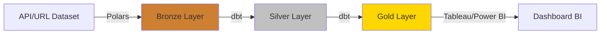
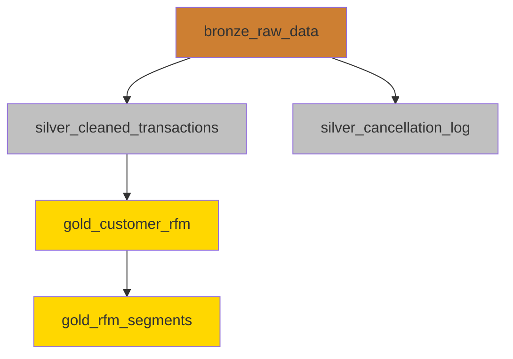

# Arquitectura Medallion - Retail Analytics

## Introducción

Este documento describe la arquitectura de datos implementada para el proyecto de análisis RFM de retail, siguiendo el patrón **Medallion Architecture** (Bronze, Silver, Gold).

## Flujo de Datos



## Capas de la Arquitectura

### 🥉 Capa Bronze (Raw Data)

**Propósito:** Almacenar datos crudos sin transformaciones

**Tecnología:** Polars + DuckDB

**Proceso:**
1. Script Python (`ingestion_polars.py`) descarga datos desde URL
2. Polars lee el archivo Excel directamente en memoria
3. Datos se cargan a DuckDB en tabla `bronze.raw_data`
4. **No se almacena archivo local** (ingesta dinámica)

**Características:**
- ✅ Datos inmutables (append-only)
- ✅ Sin transformaciones
- ✅ Auditoría completa
- ✅ Punto de recuperación ante errores

**Modelo dbt:**
- `bronze_raw_data.sql`: Vista sobre la tabla cargada

---

### 🥈 Capa Silver (Cleaned Data)

**Propósito:** Datos limpios, validados y enriquecidos

**Tecnología:** dbt + DuckDB

**Transformaciones Aplicadas:**

#### 1. **Limpieza de Datos**
- Filtrado de transacciones canceladas (InvoiceNo con 'C')
- Eliminación de registros sin CustomerID
- Filtrado de cantidades y precios inválidos (≤ 0)

#### 2. **Enriquecimiento**
- Cálculo de `total_sale` = Quantity × UnitPrice
- Generación de clave subrogada (`transaction_id`)
- Extracción de componentes de fecha (año, mes, día, día de semana)
- Conversión de tipos de datos

#### 3. **Auditoría**
- Timestamp de carga (`loaded_at`)

**Modelos dbt:**
- `silver_cleaned_transactions.sql`: Transacciones válidas
- `silver_cancellation_log.sql`: Log de cancelaciones/devoluciones

**Calidad de Datos:**
```sql
-- Tests implementados
- not_null: customer_id, invoice_no
- unique: transaction_id
- accepted_values: quantity > 0, unit_price > 0
```

---

### 🥇 Capa Gold (Analytics)

**Propósito:** Modelos analíticos listos para consumo en BI

**Tecnología:** dbt + DuckDB

**Modelos Implementados:**

#### 1. **gold_customer_rfm.sql**
Cálculo de métricas RFM por cliente:

| Métrica | Definición | Cálculo |
|---------|------------|---------|
| **Recency** | Días desde última compra | `analysis_date - MAX(invoice_date)` |
| **Frequency** | Número de transacciones | `COUNT(DISTINCT invoice_no)` |
| **Monetary** | Valor total gastado | `SUM(total_sale)` |

**Métricas Adicionales:**
- Valor promedio de transacción
- Total de ítems comprados
- Fecha primera/última compra
- Lifetime del cliente (días)

#### 2. **gold_rfm_segments.sql**
Segmentación de clientes basada en scores RFM:

**Metodología de Scoring:**
- Quintiles (1-5) para cada métrica
- Recency: **invertido** (menor días = mejor score)
- Frequency y Monetary: mayor valor = mejor score

**Segmentos de Negocio:**

| Segmento | Criterios | Estrategia | Prioridad |
|----------|-----------|------------|-----------|
| **Champions** | R≥4, F≥4, M≥4 | Recompensar y retener | 🔴 Alta |
| **Loyal Customers** | R≥3, F≥4 | Upselling/Cross-selling | 🟡 Media |
| **Potential Loyalists** | R≥4, F=2-3 | Engagement programs | 🟡 Media |
| **New Customers** | R≥4, F≤2 | Onboarding campaigns | 🟢 Media |
| **At Risk** | R≤2, F≥4 | Win-back campaigns | 🔴 Alta |
| **Cannot Lose Them** | R≤1, F≥4, M≥4 | Aggressive retention | 🔴 Crítica |
| **Hibernating** | R≤2, F≤2 | Reactivation emails | 🟢 Baja |
| **Lost** | R≤1, F≤2 | Reconquest campaigns | 🟢 Baja |

---

## Tecnologías Utilizadas

### DuckDB
- **Ventajas:**
  - Base de datos analítica embebida
  - Alto rendimiento en queries analíticos
  - Sin necesidad de servidor
  - Soporte nativo para Parquet, CSV, JSON
  - Integración perfecta con dbt

### dbt (data build tool)
- **Ventajas:**
  - Transformaciones SQL versionadas
  - Testing automático de calidad de datos
  - Documentación autogenerada
  - Linaje de datos visual
  - Modularidad y reutilización

### Polars
- **Ventajas:**
  - Procesamiento ultra-rápido (Rust backend)
  - API expresiva similar a Pandas
  - Lazy evaluation
  - Soporte nativo para múltiples formatos
  - Bajo consumo de memoria

---

## Ejecución del Pipeline

### 1. Ingesta (Bronze)
```bash
python ingestion_polars.py
```

### 2. Transformaciones (Silver + Gold)
```bash
cd dwh
dbt run
```

### 3. Tests de Calidad
```bash
dbt test
```

### 4. Documentación
```bash
dbt docs generate
dbt docs serve
```

---

## Linaje de Datos



---

## Escalabilidad y Mantenimiento

### Escalabilidad
- ✅ DuckDB maneja datasets de varios GB en memoria
- ✅ Polars procesa archivos grandes eficientemente
- ✅ dbt permite paralelización de modelos

### Mantenimiento
- ✅ Código SQL versionado en Git
- ✅ Tests automáticos de calidad
- ✅ Documentación autogenerada
- ✅ Fácil debugging con dbt logs

### Mejoras Futuras
- [ ] Orquestación con Airflow/Prefect
- [ ] Alertas automáticas de calidad de datos
- [ ] Versionado de modelos ML
- [ ] Integración con Great Expectations
